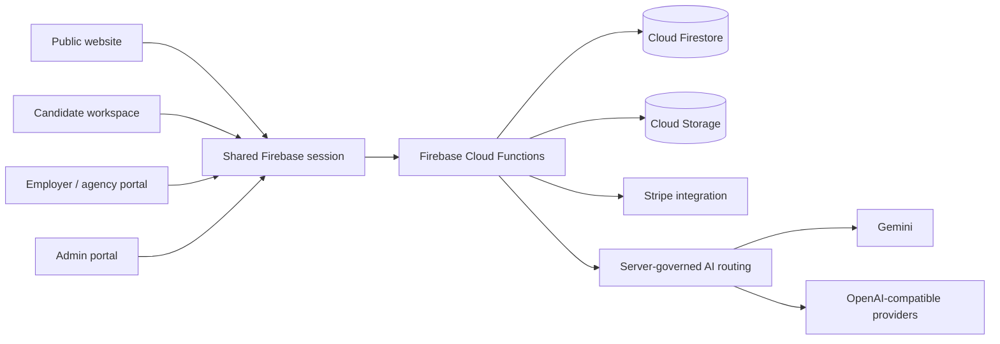

# Career CoPilot


Career CoPilot brings resume review, job matching, application tracking, interview practice, and hiring workflows into one web app.

[Try the interactive demo](https://copilot.kairwang.cloud/) · [Open a sample report](https://copilot.kairwang.cloud/sample-report) · [View the employer experience](https://copilot.kairwang.cloud/employers)

## How we used Codex and GPT-5.6

We used Codex with GPT-5.6 to work in the existing codebase during Build Week. It helped us trace the React and Firebase flows, investigate failing tests, check security boundaries, and prepare the demo and submission materials.

The biggest time savings came from following a problem across the frontend, Cloud Functions, Firestore rules, and tests without losing context. For example, Codex reviewed the credit and refund paths, provider routing, billing entitlements, and CI release gates. Relevant code and tests are linked in [`functions/src/credits/`](functions/src/credits/), [`functions/src/llm/models.ts`](functions/src/llm/models.ts), [`functions/src/billing/entitlement.ts`](functions/src/billing/entitlement.ts), and [`tests/`](tests/).

Our team still made the product, engineering, and design decisions. We chose the scope, reviewed each change, decided what belonged in the demo, and kept the final release behind the repository gates in [`.github/workflows/ci.yml`](.github/workflows/ci.yml).

Career CoPilot does not require GPT-5.6 as its only runtime model. Product requests use a server-managed provider layer that supports Gemini and OpenAI-compatible providers; GPT-5.6 and Codex were used to build and validate this submission.

## Why Career CoPilot

Career development is fragmented. Candidates move among resume editors, job boards, spreadsheets, interview tools, and generic advice, while employers review applications without a consistent connection to the candidate's goals, evidence, and progress.

Career CoPilot connects that workflow:

```text
Career intent → Resume evidence → Opportunity fit → Application → Interview → Hiring decision
```

It complements marketplaces such as LinkedIn and Indeed by focusing on the guided work around an application rather than trying to replace their networks or job inventory.

## What it does

### Candidate workspace

- Resume readiness analysis with actionable evidence
- Career-path planning with milestones, skills, and next steps
- Explainable opportunity matching
- Application tracking and status history
- Timed interview practice with session-level feedback
- Cover letters, outreach messages, learning plans, and portfolio tools

### Employer and agency workflows

- Job posting and applicant management
- Consent-gated talent discovery
- Candidate matching with supporting reasons
- Structured hiring stages, interviews, scorecards, messages, and shortlists
- Limited, revocable candidate packets instead of unrestricted live-profile access

### Platform governance

- Role-based administration for reviewers, administrators, and super administrators
- Model registry, routing pools, prompts, keys, quotas, and audit records
- Server-authoritative credits, subscriptions, hiring transitions, and API access
- Seven UI languages: English, French, Chinese, Japanese, German, Vietnamese, and Arabic

## Product evidence

| Candidate resume report | Interview feedback |
|---|---|
|  |  |

| Career path planner | Employer candidate match |
|---|---|
|  |  |

These images were captured from the running application and are not conceptual UI mockups.

## Architecture



The frontend is a React 19, TypeScript, Vite, and Tailwind CSS application. Firebase provides Authentication, Firestore, Storage, and Cloud Functions. Privileged operations run on the server instead of trusting browser state.

Every metered AI request follows a governed path:

1. Authenticate and validate the caller.
2. Limit the payload and claim an idempotent request ID.
3. Check quota and deduct credits when required.
4. Resolve an allowed provider through platform-managed routing.
5. Validate structured output before returning it to the UI.
6. Record usage or issue an idempotent refund when execution fails.

## Trust and reliability

- Provider keys remain server-side.
- Clients cannot grant themselves roles, credits, subscriptions, or hiring outcomes.
- AI fallback is reserved for availability failures; quality failures are surfaced rather than hidden by silent model switching.
- Talent discovery requires candidate opt-in, and identifiable packets are time-limited and revocable.
- Stripe checkout and entitlement paths use deterministic idempotency and exact plan/audience/mode checks.
- Failed credit refunds enter a durable recovery queue instead of disappearing into logs.

The repository includes a layered gate for source checks, emulator contracts, runtime smoke tests, and browser E2E:

```bash
npm run gate:release:source
npm run gate:release:emulator
npm run gate:release:browser
```

Release-gate success proves the reviewed source and controlled test environments. It does not replace live Stripe, email/DNS, Firebase IAM/TTL, privacy-operations, or real-device launch evidence.

## Judge quickstart

No rebuild is required for evaluation:

1. Open the [interactive demo](https://copilot.kairwang.cloud/).
2. Review the [sample resume-readiness report](https://copilot.kairwang.cloud/sample-report).
3. Open the [employer experience](https://copilot.kairwang.cloud/employers) to inspect candidate matching and structured hiring stages.
4. Use the product evidence and source links in this README to verify implementation details.

The hosted experience supports current desktop and mobile browsers on macOS, Windows, iOS, and Android. Local development is supported on macOS, Windows, and Linux with the prerequisites below.

Build Week evaluation references:

- [Public demo video (2:56)](https://youtu.be/f64ERb7nwbU)
- [Submitted Devpost project](https://devpost.com/software/career-copilot-tw14kl)
- Codex `/feedback` session ID: `019f65f0-8e51-7411-8cac-f29496748fe5`
- [OpenAI Build Week video script and compliance notes](docs/submission/VIDEO_SCRIPT.md)
- [Devpost submission references](docs/submission/DEVPOST_COPY.md)

## Run locally

### Prerequisites

- Node.js 22
- npm 10.8–11.x
- Java 21 and Firebase CLI for emulator-backed suites

### Install and start

```bash
npm ci
npm --prefix functions ci
cp .env.example .env.local
# Add the public VITE_FIREBASE_* web-app values to .env.local.
npm run dev
```

AI provider credentials must remain server-side. Never place provider secrets in `VITE_*` variables.

### Useful validation commands

```bash
npm run typecheck
npm run typecheck:functions
npm run test:unit
npm run test:rules
npm run test:callables
```

## Technology

TypeScript · React 19 · Vite · Tailwind CSS · Node.js · Firebase Authentication · Cloud Firestore · Cloud Functions · Cloud Storage · Gemini · OpenAI-compatible APIs · Stripe · Sentry · Vitest · Playwright · GitHub Actions

## Current status and next steps

The public URL is an interactive product demo. Before broad customer launch, the project still requires environment-specific evidence for live Stripe webhooks, transactional email and DNS, production Firebase indexes/TTL/IAM, real-provider quality and cost, observability operations, privacy/retention decisions, and representative device testing.

Next product priorities are pilot feedback from candidates and employers, stronger AI quality evaluation, lower latency, accessibility testing, and decomposition of the largest candidate, employer, and admin modules.

## Team

Career CoPilot was created by a six-person University of Ottawa project team:

- **Kair Wang** — project coordination, product planning, and frontend architecture
- **Jingxuan Xu (Joyce)** — backend, APIs, Firebase migration, and server-authoritative credits
- **Xiaoyi Zhang** — Firestore data modeling, employer workflows, and data-heavy UI
- **Xiaoyan Yang (Rita)** — QA, UI implementation, bug triage, and billing UX
- **Jiaoyang Bi** — DevOps, CI/CD, environment management, deployment, and documentation
- **Xiang Zhao** — AI/NLP, provider abstraction, prompt engineering, and evaluation design

The Codex + GPT-5.6 work described above refers to the Build Week submission, repository analysis, hardening, validation, and evaluator-facing documentation. It does not replace or erase the team's product contributions.

## More detail

- [Devpost project story](docs/devpost/PROJECT_STORY.md)
- [Production release checklist](docs/deploy-checklist.md)
- [Security review](docs/security-review.md)
- [Launch-readiness audit](docs/reviews/launch-readiness-audit-2026-07-13.md)

## License

This repository is available under the [MIT License](LICENSE).
