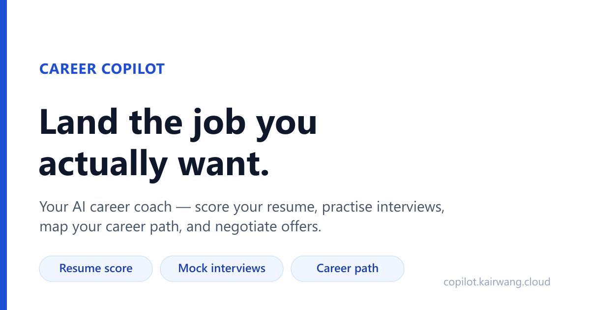
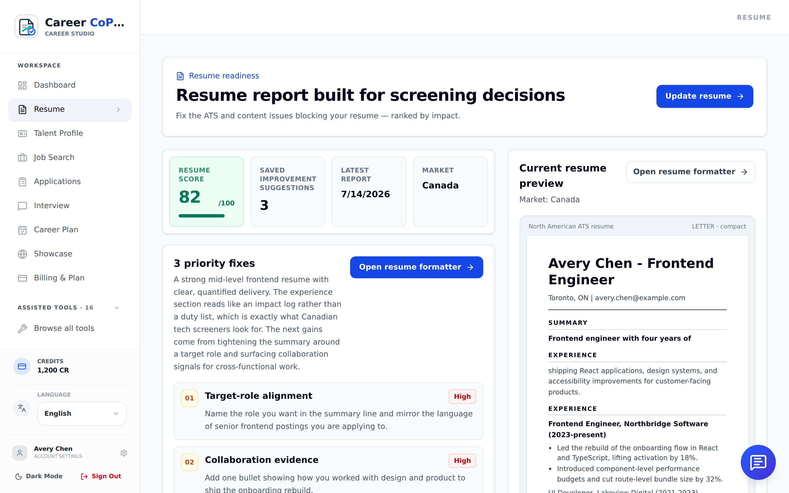
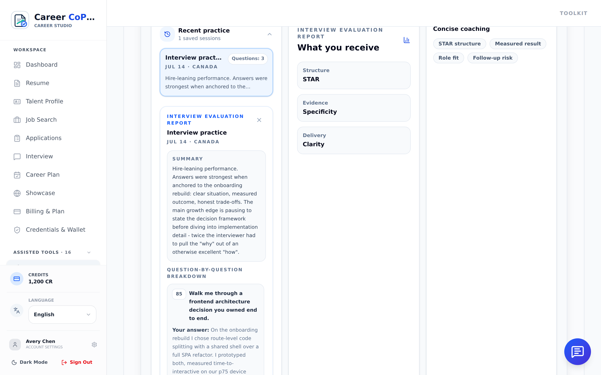
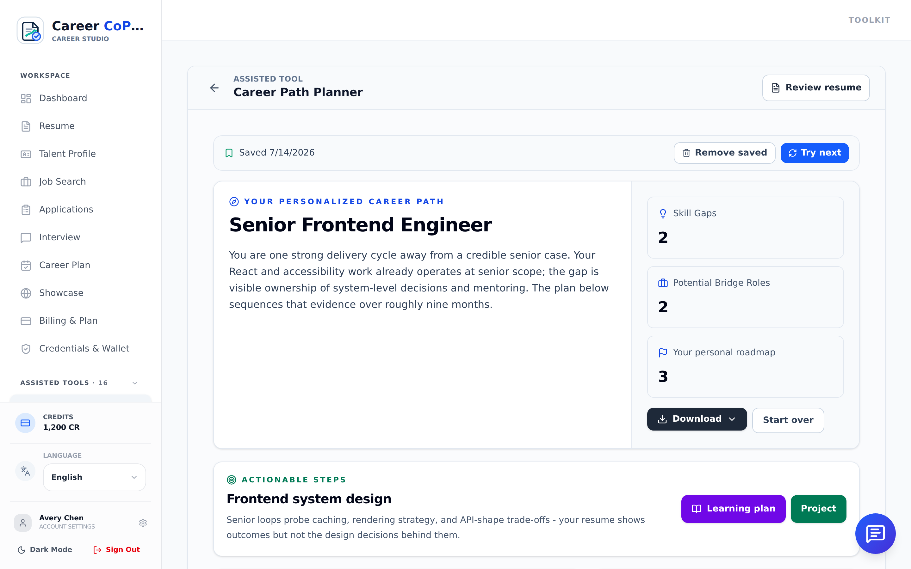
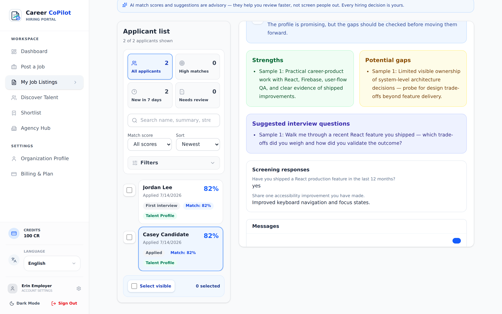
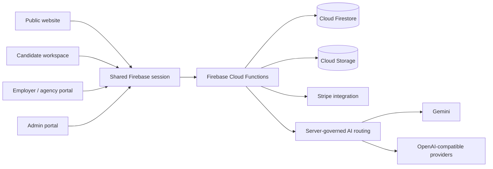

# Career CoPilot



**An AI-assisted career and hiring workspace that guides candidates from resume to interview—and helps employers turn applications into structured hiring decisions.**

[Try the interactive demo](https://copilot.kairwang.cloud/) · [Open a sample report](https://copilot.kairwang.cloud/sample-report) · [View the employer experience](https://copilot.kairwang.cloud/employers)

## Built with Codex + GPT-5.6

Codex and GPT-5.6 were used as an agentic engineering pair during the Build Week submission and hardening workflow—not as a substitute for product ownership or human review.

| Workflow | How Codex + GPT-5.6 contributed | Verifiable artifact |
|---|---|---|
| Repository understanding | Read the role-based React surfaces, Firebase trust boundaries, Cloud Functions, AI routing, billing, and release documentation before changing or describing the system. | [`CareerApp.tsx`](CareerApp.tsx), [`functions/src/index.ts`](functions/src/index.ts), [`firestore.rules`](firestore.rules) |
| Reliability analysis | Traced real failure paths across AI requests, idempotent credit charging, refunds, provider fallback, hiring transitions, and Stripe entitlement checks. | [`functions/src/credits/deductCredits.ts`](functions/src/credits/deductCredits.ts), [`functions/src/llm/models.ts`](functions/src/llm/models.ts), [`functions/src/billing/entitlement.ts`](functions/src/billing/entitlement.ts) |
| Test-driven hardening | Used failing tests and release-gate evidence to narrow root causes, review targeted fixes, and preserve exact-commit evidence instead of treating plausible code as proof. | [`scripts/run-release-gate.mjs`](scripts/run-release-gate.mjs), [`tests/`](tests/), [`e2e/`](e2e/) |
| Product communication | Turned the verified architecture and live product screens into an evaluator-first README, Devpost story, evidence map, and honest launch boundary. | [`docs/devpost/PROJECT_STORY.md`](docs/devpost/PROJECT_STORY.md), [`public/product-screenshots/`](public/product-screenshots/) |

The workflow followed three rules:

1. **Inspect before claiming.** Codex read the live repository and release audit rather than relying on a generic product description.
2. **Evidence before confidence.** Claims are linked to source, tests, screenshots, or exact release-gate evidence.
3. **Human-controlled scope.** Humans set the product direction, reviewed output, decided what to keep, and retained responsibility for deployment and launch approval.

OpenAI describes [Codex](https://developers.openai.com/api/docs/guides/code-generation#use-codex) as its coding agent for writing, reviewing, and debugging software, and recommends current GPT-5-family models such as GPT-5.6 for agentic code-generation work. That is the role Codex + GPT-5.6 played here.

> **Runtime distinction:** Career CoPilot does not hard-code GPT-5.6 as its only end-user model. Product AI requests pass through a server-governed provider layer that supports Gemini and OpenAI-compatible Chat Completions providers. This section documents how Codex + GPT-5.6 helped build and validate the submission.

## Why Career CoPilot

Career development is fragmented. Candidates move among resume editors, job boards, spreadsheets, interview tools, and generic advice, while employers review applications without a consistent connection to the candidate's goals, evidence, and progress.

Career CoPilot connects that workflow:

```text
Career intent → Resume evidence → Opportunity fit → Application → Interview → Hiring decision
```

It complements marketplaces such as LinkedIn and Indeed by focusing on the guided work around an application rather than trying to replace their networks or job inventory.

## What it does

### Candidate workspace

- Resume readiness analysis with actionable evidence
- Career-path planning with milestones, skills, and next steps
- Explainable opportunity matching
- Application tracking and status history
- Timed interview practice with session-level feedback
- Cover letters, outreach messages, learning plans, and portfolio tools

### Employer and agency workflows

- Job posting and applicant management
- Consent-gated talent discovery
- Candidate matching with supporting reasons
- Structured hiring stages, interviews, scorecards, messages, and shortlists
- Limited, revocable candidate packets instead of unrestricted live-profile access

### Platform governance

- Role-based administration for reviewers, administrators, and super administrators
- Model registry, routing pools, prompts, keys, quotas, and audit records
- Server-authoritative credits, subscriptions, hiring transitions, and API access
- Seven UI languages: English, French, Chinese, Japanese, German, Vietnamese, and Arabic

## Product evidence

| Candidate resume report | Interview feedback |
|---|---|
|  |  |

| Career path planner | Employer candidate match |
|---|---|
|  |  |

These images were captured from the running application and are not conceptual UI mockups.

## Architecture



The frontend is a React 19, TypeScript, Vite, and Tailwind CSS application. Firebase provides Authentication, Firestore, Storage, and Cloud Functions. Privileged operations run on the server instead of trusting browser state.

Every metered AI request follows a governed path:

1. Authenticate and validate the caller.
2. Limit the payload and claim an idempotent request ID.
3. Check quota and deduct credits when required.
4. Resolve an allowed provider through platform-managed routing.
5. Validate structured output before returning it to the UI.
6. Record usage or issue an idempotent refund when execution fails.

## Trust and reliability

- Provider keys remain server-side.
- Clients cannot grant themselves roles, credits, subscriptions, or hiring outcomes.
- AI fallback is reserved for availability failures; quality failures are surfaced rather than hidden by silent model switching.
- Talent discovery requires candidate opt-in, and identifiable packets are time-limited and revocable.
- Stripe checkout and entitlement paths use deterministic idempotency and exact plan/audience/mode checks.
- Failed credit refunds enter a durable recovery queue instead of disappearing into logs.

The repository includes a layered gate for source checks, emulator contracts, runtime smoke tests, and browser E2E:

```bash
npm run gate:release:source
npm run gate:release:emulator
npm run gate:release:browser
```

Release-gate success proves the reviewed source and controlled test environments. It does not replace live Stripe, email/DNS, Firebase IAM/TTL, privacy-operations, or real-device launch evidence.

## Run locally

### Prerequisites

- Node.js 22
- npm 10.8–11.x
- Java 21 and Firebase CLI for emulator-backed suites

### Install and start

```bash
npm ci
npm --prefix functions ci
cp .env.example .env.local
# Add the public VITE_FIREBASE_* web-app values to .env.local.
npm run dev
```

AI provider credentials must remain server-side. Never place provider secrets in `VITE_*` variables.

### Useful validation commands

```bash
npm run typecheck
npm run typecheck:functions
npm run test:unit
npm run test:rules
npm run test:callables
```

## Technology

TypeScript · React 19 · Vite · Tailwind CSS · Node.js · Firebase Authentication · Cloud Firestore · Cloud Functions · Cloud Storage · Gemini · OpenAI-compatible APIs · Stripe · Sentry · Vitest · Playwright

## Current status and next steps

The public URL is an interactive product demo. Before broad customer launch, the project still requires environment-specific evidence for live Stripe webhooks, transactional email and DNS, production Firebase indexes/TTL/IAM, real-provider quality and cost, observability operations, privacy/retention decisions, and representative device testing.

Next product priorities are pilot feedback from candidates and employers, stronger AI quality evaluation, lower latency, accessibility testing, and decomposition of the largest candidate, employer, and admin modules.

## More detail

- [Devpost project story](docs/devpost/PROJECT_STORY.md)
- [Production release checklist](docs/deploy-checklist.md)
- [Security review](docs/security-review.md)
- [Launch-readiness audit](docs/reviews/launch-readiness-audit-2026-07-13.md)
